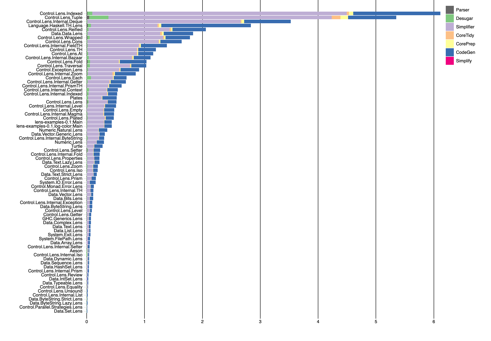
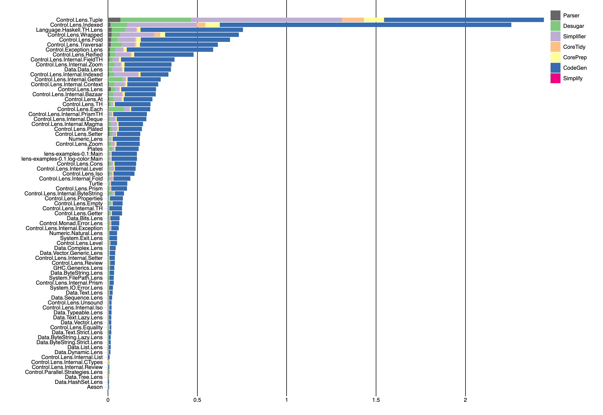

# Do you want to know why it takes so long for your Haskell project to compile?

YES

## Use this shell script in a stack project

In this repo there's a shell script `stack-passes` that reads from your `.stack-work` directory.

## Dependencies?

You'll need `textql`. You can get it from `sudo apt install textql` in Debian or Ubuntu.

## Ok, how do I make it go?

Change into a directory where you've built a stack project and run `stack-passes`.

That script will create a new file `ghc-passes-grouped.csv`. Copy that
file into your clone of this project, run a web server in this
directory, and load it in your browser.

For example, the Haskell `warp` server will serve the folder on
`http://localhost:3000/` or `python3 -m http.server` behaves
similarly, if you have python installed.

# How do I turn this information into actions to reduce my compile time?

For incremental builds, try to make your module structure as tree shaped as possible.
When you change a module that all other modules use, all modules must be recompiled.
The more tree shaped your package dependencies, the less time spent doing incremental compiles when making changes.

GHC has [many
flags](https://downloads.haskell.org/ghc/latest/docs/html/users_guide/debugging.html)
to get more information about what goes on in particular phases.  The
graphs generated by `stack-passes` can be used as a first step, to
find out which phases and modules dominate your compile time, and then
you get more verbose output for those sections.

# Example Output

When run on the [lens](https://github.com/ekmett/lens) package, `stack-passes` produces the following graph:

If you compile `lens` with `stack --fast` (equivalent to GHC's `-O0`),
you instead get the graph below.  Note that the Simplifier bars which
dominated the graph above have shrunk to nothing.  The **Simplifier**
phase is where most of GHC's optimization work occurs.

When you load a module in `ghci`, it is type checked, but no code is
generated until you actually want to run it.  So the **CodeGen** bars,
which dominate the second graph, also can be skipped.
